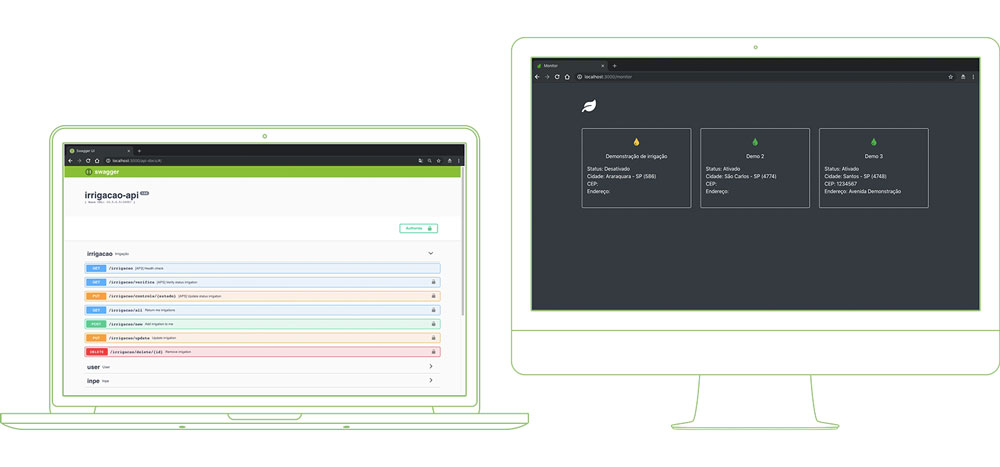

# TCC

Trabalho apresentado a **UNIVERSIDADE PAULISTA** como pré-requisito para obtenção da **Certificação de Conclusão de Curso de Bacharelado em Ciência da Computação**.

- Aluno: [Rodrigo Cichetto](https://github.com/rodrigocichetto) 
- Profº Orientador: [Leandro Carlos Fernandes](https://github.com/leandro-carlos-fernandes)

## Resumo

Já pensou em criar uma rápida prototipação de software ou desenvolver aplicações escaláveis de forma rápida e utilizando apenas uma linguagem? Isso é possível e traz benefícios a empresa, desenvolvedores e até mesmo ao cliente. Nos últimos tempos o JavaScript ganhou muita importância em quaisquer cenários, e vem sendo utilizada em sites, aplicações, mobile, servidores, automação de testes, automação de tarefas, internet das coisas, entre outros. 

Este trabalho tem como principal objetivo apresentar benefícios de utilizar a linguagem JavaScript em todas as camadas do desenvolvimento, destacando ferramentas já existentes aplicadas a arquitetura multicamadas. Mas lembre-se com grandes poderes vem grandes responsabilidades.

## Código

Foi criado uma aplicação para mostrar na prática os conceitos apresentados no trabalho, todo o código está disponível na pasta [src](/src).

## Docker

Para iniciar a aplicação com apenas um comando, suba os containers indo até a pasta `src` e executando o comando:
```
docker-compose up -d
```

### Containers
- **tcc-api**

    Ip: 10.5.0.5:3000 (Abrir documentação no navegador)

    Logs: `docker logs -f tcc-api`

    

- **tcc-app-mobile**

    Ip: 10.5.0.6:8200 (Abrir no navegador)

    Logs: `docker logs -f tcc-app-mobile`

    

- **tcc-mongodb**

    Ip: 10.5.0.7:27017

    Logs: `docker logs -f tcc-mongodb`

### .env configs

```
NODE_VERSION=alpine                 # (Versão do node a ser executada no container tcc-api)
NETWORK_SUBNET=10.5.0.0/16          # (Máscara de rede a ser utilizada)
API_PORT=3000                       # (Porta API)
API_IPV4_ADDRESS=10.5.0.5           # (IP da API)      
APP_MOBILE_PORT=8200                # (Porta aplicação cliente)
APP_MOBILE_IPV4_ADDRESS=10.5.0.6    # (Ip aplicação cliente)
DB_PORT=27017                       # (Porta banco de dados)
DB_IPV4_ADDRESS=10.5.0.7            # (Ip banco de dados)
DB_USER=user                        # (Usuário banco de dados)
DB_PASSWORD=pass                    # (Senha banco de dados)
DB_DATABASE=tcc                     # (Schema banco de dados)
DUMP_DEMO=true                      # (Iniciar com dump de demonstração)
```

## License
Os códigos deste projeto estão licenciados sob a licença [MIT](LICENSE) - veja o arquivo [LICENSE](LICENSE) para mais detalhes.